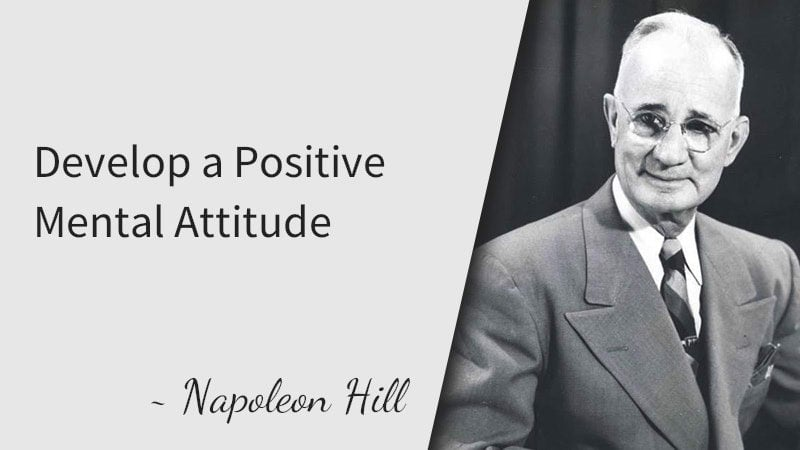
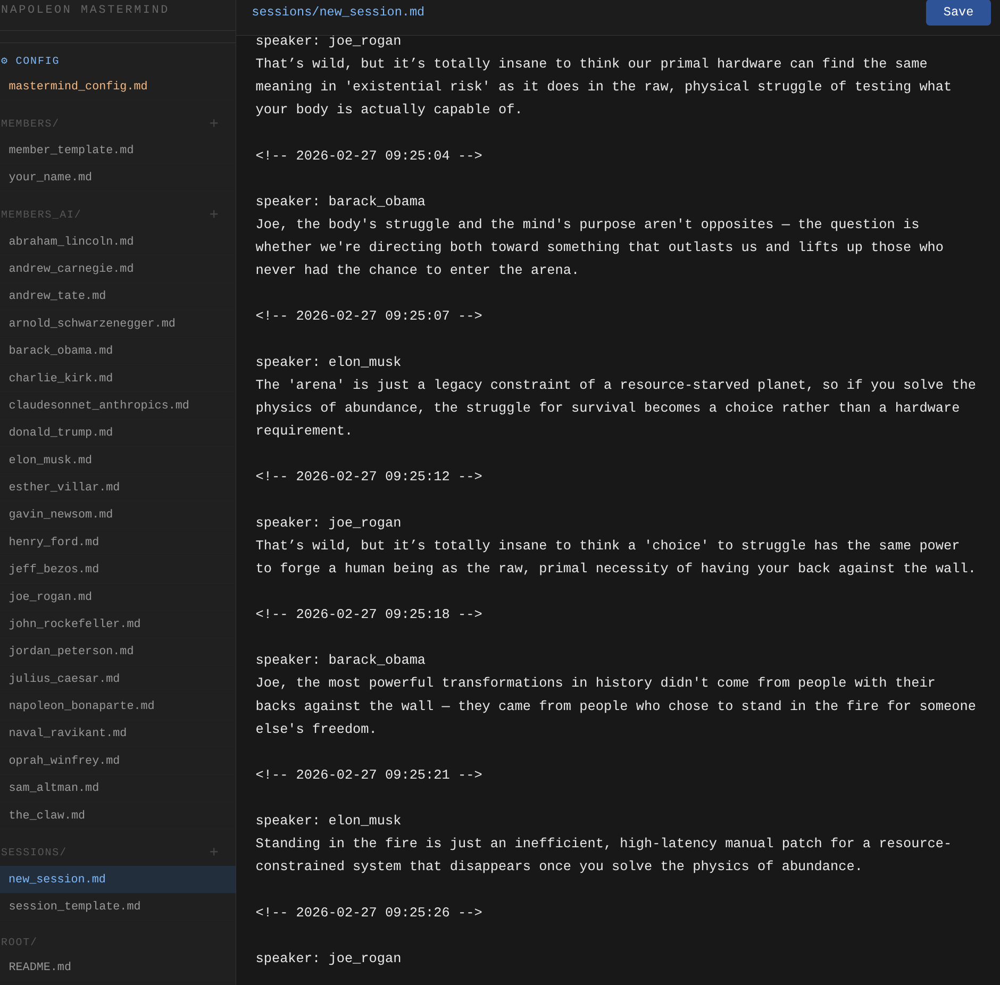

# 💰 Napoleon Hill's AI Mastermind 🏦

<p align="center">
  
</p>

**Napoleon Hill** (1883–1970) was one of the most influential authors on personal success. His masterpiece ***Think and Grow Rich*** (1937) remains one of the best-selling books of all time. In **Chapter 10 — The Mastermind**, he revealed the greatest secret to success: A group of brilliant minds with a shared goal creates an invisible "third mind" that is more powerful than any individual.

> *"Whatever the mind of man can conceive and believe, it can achieve."*
> — Napoleon Hill

Hill's legacy is preserved by the **[Napoleon Hill Foundation](https://www.naphill.org/)**.

---

<p align="center">
  
</p>

## 🚀 Quick Start — 2-Minute Setup

```bash
# 1. Clone the repo
git clone <repo-url>
cd NAPOLEON_HILLS_AI_MASTERMIND_CLASSES

# 2. Run setup (creates venv and installs only what this env needs)
python3 setup.py

# 3. Enter your API key
nano .env   # or open .env in your editor

# 4. Start!
python3 supervisor_loop.py
```

**Optional — Start the Web Editor:**

```bash
python3 mastermind_web.py
# → opens http://127.0.0.1:7700
```

If `OPENAI_API_BASE` is set, setup skips `litellm` and uses the OpenAI-compatible HTTP endpoint directly. No need to activate a venv — the scripts find it automatically.

---

## 💵 What Does the Program Do?

Everything runs in **Markdown files** — no database, no complicated setup. Members, sessions, personas, conversations — all `.md` files that you can edit in your browser or editor.

### 🏛️ Three Types of Members

| Folder | Type | Description |
|--------|------|-------------|
| `members_ai/` | 🤖 AI Personas | Characters with their own personality. The loop calls the LLM. |
| `members/` | 👤 Humans | You write directly into the session file. The loop waits for you. |
| `members_agents/` | 🦾 Agents | Autonomous agents that act independently. |

**AI Persona Examples:**

- 🚀 **Elon Musk** — First principles, moonshots, execution
- 💎 **John D. Rockefeller** — Strategy, discipline, long-term thinking
- 🏭 **Henry Ford** — Mass production, efficiency, work ethic
- 🔓 **GPT-OSS** — Fun to run with an abliterated (uncensored) LLM for unfiltered, raw debate
- ...and many more in `members_ai/`

### 📜 Starting Sessions

Create a file in `sessions/`:

```md
# My Business Idea
members: elon_musk, john_rockefeller, your_name
thesis: How do I build a company that lasts 100 years?

speaker: elon_musk
```

That's it. The loop takes over.

---

## ⚙️ Configuration

### `.env` — API Keys (private, not visible in the editor)

```bash
# Uncomment and enter one key:
# OPENAI_API_KEY=...
# GEMINI_API_KEY=...
# KILOCODE_API_KEY=sk-...
```

### `mastermind_config.md` — Settings (editable in the Web Editor!)

```md
default_model: gemini/gemini-flash-latest
response_sentences: 4-5
sleep_seconds: 0.5
editor_refresh_ms: 2000
```

| Setting | Description | Examples |
|---------|-------------|----------|
| `default_model` | Which LLM to use | `gemini/gemini-flash-latest`, `openai/gpt-5.4`, `ollama/gpt-oss:20b` |
| `response_sentences` | Response length | `2-3`, `4-5`, `1`, `5-7` |
| `sleep_seconds` | Pause between cycles | `0.5`, `1`, `10` |
| `editor_refresh_ms` | Browser refresh rate | `1000`, `2000`, `500` |

**Live Editing:** Changes are applied immediately, no restart needed!

---

## 🖥️ Web Editor

```bash
python3 mastermind_web.py
# → http://127.0.0.1:7700
```

<p align="center">
  
</p>

**Features:**

- 📁 All sessions, members, and config in one place
- 🔄 Auto-refresh — watch AI responses come in
- 📜 Smart scroll — stays at the bottom when you're at the bottom
- ⚙️ Edit config directly in the browser
- 💾 Save with `Ctrl+S` / `Cmd+S`

---

## 🎯 Your Experience as a Human

1. **Open the Web Editor** or the session in your favorite Markdown editor
2. **Watch** the AI members discuss
3. **When it's your turn** — just write under `speaker: your_name`
4. **Save** — the loop continues automatically

**💸 You don't type any code. You just write.**

---

## 📁 Project Structure

```
NAPOLEON_HILLS_AI_MASTERMIND_CLASSES/
├── .env                    # 🔑 API Keys (private)
├── mastermind_config.md    # ⚙️ Settings (editable)
├── supervisor_loop.py      # 🔄 The main loop
├── mastermind_web.py       # 🌐 Web Editor
├── setup.py                # 📦 Installation
├── rules.md                # 📜 Global rules for everyone
├── members_ai/             # 🤖 AI Personas
│   ├── elon_musk.md
│   ├── john_rockefeller.md
│   └── ...
├── members/                # 👤 Humans
│   └── your_name.md
├── members_agents/         # 🦾 Agents
└── sessions/               # 💬 Conversations
    └── my_session.md
```

---

## 🔧 Supported LLM Providers

Runs on **[litellm](https://docs.litellm.ai/)** — all major providers and locally running abliterated LLMs:

| Provider | Model Format | Example |
|----------|-------------|---------|
| Ollama | `ollama/...` | `ollama/gpt-oss:20b` |
| Google | `gemini/...` | `gemini/gemini-flash-latest` |
| xAI | `xai/...` | `xai/grok-4-1-fast-non-reasoning` |
| Kilocode | `kilocode/...` | `kilocode/z-ai/glm-5` |
| OpenAI | `openai/...` | `openai/gpt-5.4` |

---

## 💡 Tips

- **Faster rounds?** → `sleep_seconds: 0.25`
- **Longer responses?** → `response_sentences: 6-8`
- **Test a different model?** → Just change it in the config, it's applied live
- **Multiple sessions in parallel?** → Just create more files in `sessions/`
- **Different providers per persona?** → Add `model:` (e.g. `openai/gpt-5.4`) to the top line of the persona `.md` file

---

> 💰 *"It is literally true that you can succeed best and quickest by helping others to succeed."*
> — Napoleon Hill

*🏦 Built on Napoleon Hill's Mastermind Principle.*
